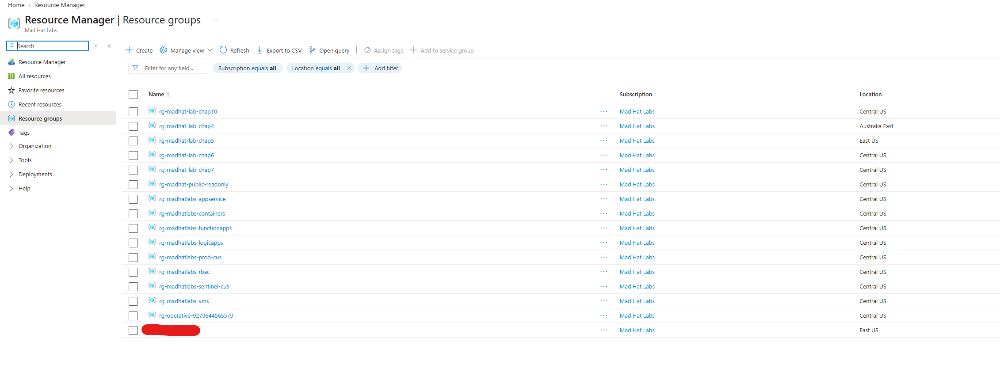
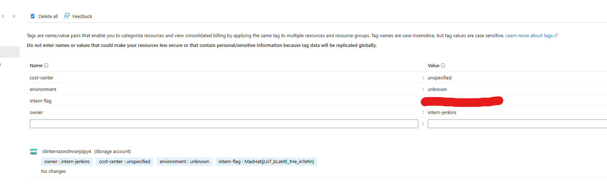

Investigated a mislabeled resource group in azure.

A junior intern was given temporary Contributor access to deploy a test environment in the Mad Hat Labs Azure subscription but created the resources without following the organization’s governance standards.
As the on-call Azure engineer with Reader access, I investigated the environment to determine what was deployed, identify which governance controls failed or were bypassed, and document the resulting risks and evidence.

-  Microsoft Azure
-  Live multi-user Azure training tenant
-  Reader access
-  Azure Resource Groups, Virtual Machines, Storage Accounts, Virtual Networks, and Network Security Groups
-  Azure Policy, resource tagging, naming standards, security configuration, and resource organization
-  Azure Portal, Activity Log, and Azure Policy

## Investigation

1. I opened the portal and began looking at resource groups to see if any looked out of place. Towards the bottom I found my culprit.
   
3. After this I opened the RG and saw that it had only one resource deployed. I opened that and inspected the tags. I found that its owner was the intern.
  
   

## What broke / what surprised me
The most credible section in the document. Dead ends, wrong guesses, the thing that took an hour. Employers know real work is messy. This section separates you from certificate collectors.

## Findings and recommendations
What you determined, plus 2 or 3 recommendations as if you were reporting to the resource owner.

## What I learned
3 to 5 bullets. At least one technical, one "what I'd do differently."
