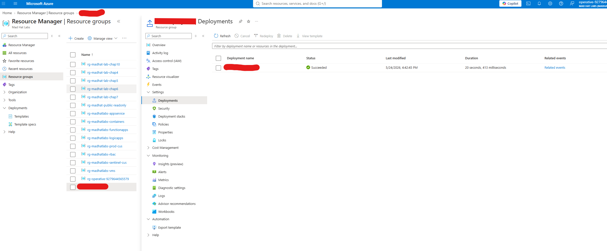
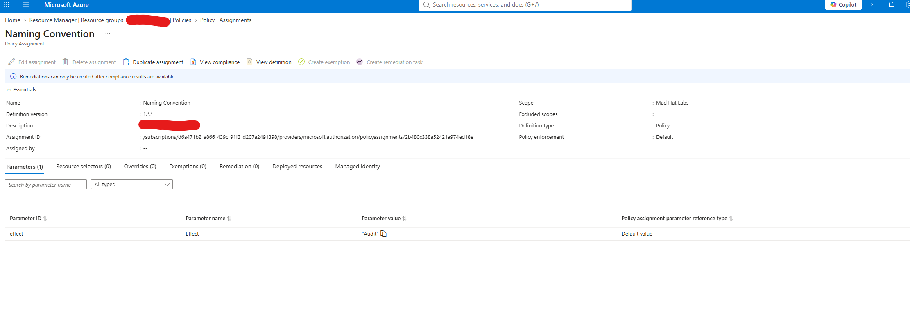

# Investigating an Azure Governance Failure

## Scenario

A junior intern was given temporary Contributor access to deploy a test environment in the Mad Hat Labs Azure subscription. The resources were deployed without following the organization's governance standards, so I investigated the environment with Reader access to determine what was created, trace how it was deployed, and identify why Azure Policy failed to prevent the non-compliant deployment.

## Environment

- **Platform:** Microsoft Azure
- **Environment:** Live multi-user Azure training tenant
- **Access Level:** Reader
- **Services Investigated:** Azure Resource Groups and deployed Azure resources
- **Governance Controls:** Azure Policy, resource tagging, and naming standards
- **Tools Used:** Azure Portal, Azure Resource Manager deployment history, and Azure Policy

## Investigation

1. I opened the portal and began looking at resource groups to see if any looked out of place. Towards the bottom I found my culprit.
   
3. After this I opened the RG and saw that it had only one resource deployed. I opened that and inspected the tags. I found that its owner was the intern.
  
3. I wanted to determine how the intern's resource was originally created, so I returned to the resource group and reviewed its deployment history.
   Since Azure Resource Manager records deployments made against a resource group, I used the Deployments blade to trace the resource back to the deployment that created it.
   I reviewed the deployment details, including its name, timestamp, parameters, and deployment status.
   The deployment name provided additional evidence connecting the resource to the intern and helped establish when the environment was created.
   
4. After confirming how the resource was deployed, I investigated why Azure Policy did not prevent the improperly named resource from being created.
   I found that the naming convention policy was active and correctly identified the resource as non-compliant, but it had still allowed the deployment to succeed. I reviewed the policy assignment and found that its **Effect** was set to `Audit` instead of `Deny`.
 This explained the governance failure: the policy was configured to detect and report naming violations rather than block them, allowing the intern's non-compliant resource to be created.
   

## What broke / what surprised me
Honestly the only thing that tripped me up was in the beginning I did not set enough rows to see the misnamed resource group

## Findings and recommendations

The investigation determined that the intern was able to deploy a resource that did not follow Mad Hat Labs' naming standards because the naming convention policy was configured with an `Audit` effect. The policy successfully detected the violation and marked the resource as non-compliant, but it was not configured to prevent the deployment.

- **Change the naming policy effect from `Audit` to `Deny`** after validating the policy against existing resources. This would prevent future resources that violate the naming convention from being deployed.
- **Require appropriate resource tags** such as owner, environment, and purpose so resources can be quickly traced back to the person or project responsible for them.
- **Review temporary Contributor access and deployment procedures** to ensure users understand governance requirements before being given permission to deploy resources.

## What I learned

- Azure Policy can identify a resource as non-compliant without necessarily preventing that resource from being created.
- The `Audit` policy effect records policy violations, while `Deny` can block a deployment that does not meet the policy requirements.
- Azure Resource Manager deployment history can be used to trace how and when resources were deployed.
- Tags and naming standards are useful during an investigation because they can help identify a resource's owner and purpose.
- **What I'd do differently:** I would check the policy assignment and its effect earlier in the investigation instead of assuming that an active policy was configured to enforce the standard.
