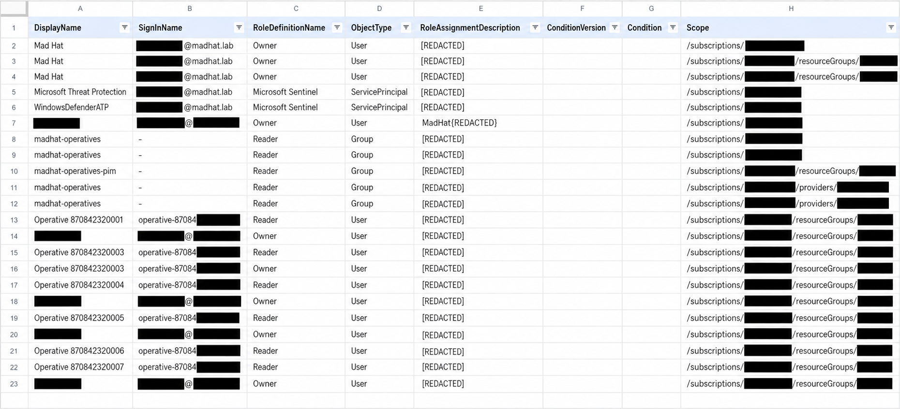
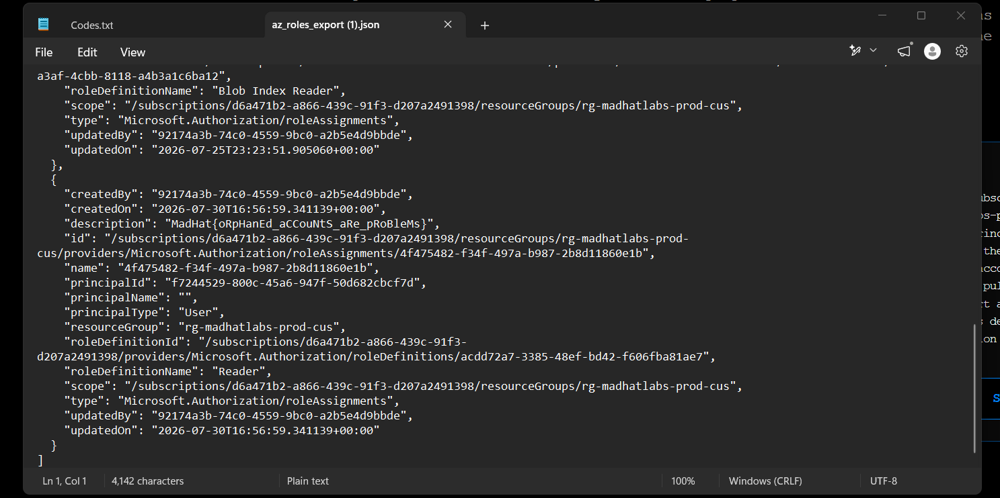

# The Privilege Audit

### Auditing Privileged Access Across Azure

## Scenario

This assessment focused on auditing privileged access across a live Azure environment.

Rather than investigating a known security incident, the goal was to determine **who had privileged access, where that access applied, and whether the assignments were necessary and properly managed**.

I performed the audit using multiple Azure methods to compare what each could reveal and where each had visibility gaps.

---

## Environment

* **Platform:** Microsoft Azure / Microsoft Entra ID
* **Environment:** Live multi-user Azure training tenant
* **Access:** Reader access, plus one PIM-eligible role
* **Services reviewed:** Azure RBAC, Microsoft Entra ID, Privileged Identity Management (PIM)
* **Tools used:**

  * Access Control (IAM)
  * Azure CLI
  * Azure Resource Graph Explorer / KQL
  * Microsoft Entra Privileged Identity Management (PIM)
* **Audit focus:** Privileged role assignments, excessive access, orphaned assignments, standing vs. eligible privilege, and assignment scope

> **Note:** Sensitive lab values have been intentionally redacted. Challenge flags, RoleAssignmentDescription values, orphaned principal IDs, and other challenge-specific identifiers are not included.

---

# Scope and Methodology

Azure provides several methods for reviewing role assignments, but each method exposes different information.

For this audit, I reviewed privileged access using four Azure tools and then performed a final manual hunt using the information gathered throughout the assessment.

My goal was not only to identify questionable access but also to understand **which audit method was best suited for each task and what each method could miss.**

## Methodology Comparison

| Method                   | What It Shows                                                                           | What It Can Miss                                                                  |
| ------------------------ | --------------------------------------------------------------------------------------- | --------------------------------------------------------------------------------- |
| **IAM blade / export**   | Active assignments at a selected scope, including inherited assignments                 | Group membership and easily overlooked orphaned principals                        |
| **Azure CLI**            | Scriptable RBAC assignment data, including fields that can expose unresolved principals | Typically requires querying individual scopes unless additional scripting is used |
| **Resource Graph (KQL)** | Role assignments across the Azure environment in a single query                         | Eligible PIM assignments                                                          |
| **PIM export**           | Eligible vs. active privileged assignments and activation history                       | Standing assignments that were never managed through PIM                          |

---

# Audit

## 1. Establishing an Access Baseline with IAM

### Method: Access Control (IAM) Blade

I started the privilege audit with Azure's **Access Control (IAM)** blade.

Every Azure scope has its own IAM view, including management groups, subscriptions, resource groups, and individual resources. This makes IAM the simplest starting point for determining which identities currently have access and what roles they hold.

Rather than manually inspecting every assignment, I reviewed the **Download role assignments** export. Exporting role assignments from the subscription level provides a broader view because the report can include inherited assignments as well as assignments associated with child resources.

Because my operative account had restricted visibility, I could not generate the complete export with identity names myself. For this portion of the audit, I reviewed a provided role-assignment CSV representing the data an auditor would normally obtain from the subscription-level export.

### What I Looked For

I reviewed the role-assignment export for:

* Highly privileged roles such as **Owner**
* Users with privileged access across multiple scopes
* Direct user assignments versus group-based access
* Assignments inherited from higher scopes
* Repeated or potentially redundant assignments
* Unusual assignments or identities requiring further investigation

### What I Found

The export established my initial baseline of active privilege within the subscription.

During the review, I identified a user account holding the **Owner** role at the subscription level. I also observed additional Owner assignments associated with the same identity at lower scopes in the environment.

A subscription-level Owner assignment stood out because permissions granted at a higher scope can apply to resources beneath it. This raised the question of whether the additional lower-scope assignments were necessary or whether the account had been granted more access than required.

At this stage, I did **not** assume that the assignments were malicious or incorrectly configured. Instead, I treated the pattern as something that warranted further investigation using the other audit methods.

### Blind Spot

The IAM blade and role-assignment export provide a useful view of **active RBAC assignments**, but they do not provide the complete privilege picture.

For example, an assignment may show that a group has access without showing which individual users receive those permissions through group membership.

Large exports can also make stale or unresolved identities difficult to recognize manually. An abnormal assignment can easily be buried among legitimate role assignments.

This meant I needed additional tooling to continue the audit.

### Conclusion

The IAM blade and role-assignment export were effective for establishing an initial access baseline and identifying accounts that deserved deeper investigation.

However, the method was better suited for answering:

> **"Who currently has access at this scope?"**

than determining whether every assignment was still valid, necessary, or properly managed.

The privilege pattern identified here gave me a starting point for the next phase of the audit, where I used **Azure CLI** to inspect role-assignment data more directly.

### Evidence

#### Role Assignment Export



*The role-assignment export provided a subscription-level view of active Azure RBAC assignments. Sensitive lab values, challenge flags, assignment descriptions, and identifiers have been redacted.*

---

## 2. Auditing Role Assignments with Azure CLI

### Method: Azure CLI

After establishing an access baseline with the IAM export, I used **Azure CLI** to inspect the RBAC assignments from the command line.

The CLI provides access to the same underlying role-assignment data, but in a structured format that can be filtered, scripted, and repeated. This makes it more useful for recurring audits than manually clicking through individual IAM blades.

For this portion of the audit, I queried the production resource group.

### Command Used

```bash
az role assignment list --resource-group rg-madhatlabs-prod-cus
```

---

### What I Looked For

I reviewed the returned role assignments and compared them against the IAM export from the previous step.

I focused on:

- Principal IDs associated with each assignment
- Role definitions
- Assignment scope
- Principal type
- Identities that could not be resolved
- Differences between the CLI output and the IAM export

---

### What I Found

Each RBAC assignment contained a `principalId`, which is the GUID Azure uses to associate the role assignment with an identity.

However, my operative account did not have enough Microsoft Entra permissions to resolve those GUIDs into identity names. Because of this, the `principalName` field was blank in the CLI output.

A blank `principalName` alone therefore did **not** prove that an account had been deleted.

To investigate further, I cross-referenced the assignments returned by the CLI with the IAM role-assignment export from the previous step.

This comparison revealed one assignment associated with a principal that no longer existed.

The identity had been deleted, but its Azure RBAC assignment remained.

This created an **orphaned role assignment**.

> **Note:** The orphaned principal ID and challenge-specific values have been intentionally redacted from this write-up.

---

### Why the Orphaned Assignment Matters

Deleting an identity does not automatically guarantee that every authorization object associated with it has been cleaned up.

In this case, Azure still contained an RBAC assignment for an identity that could no longer be properly identified or accounted for.

From an access-governance perspective, stale assignments create unnecessary authorization state and make access reviews less reliable. Administrators should be able to explain **who or what holds every permission and why that access is required**.

If an assignment points to an identity that no longer exists, it should be investigated and removed rather than left behind as unused permission data.

---

### Blind Spot

Azure CLI provided structured and repeatable access to the RBAC data, but it still had limitations.

My account could retrieve the role assignments but could not resolve their principal IDs into Microsoft Entra identity names. I therefore needed to cross-reference the CLI results with the IAM export to determine which assignment belonged to the deleted identity.

The command was also scoped to a single resource group. Repeating the same process manually across every resource group and scope would become inefficient in a larger Azure environment.

---

### Conclusion

Azure CLI gave me a more repeatable way to enumerate RBAC assignments and inspect the underlying data than manually navigating the Azure portal.

By comparing the CLI results against the IAM export, I identified an **orphaned role assignment belonging to a deleted principal**.

The key lesson from this method was that an access audit should not only ask:

> **"What permissions exist?"**

It should also ask:

> **"Does the identity associated with each permission still exist and still require that access?"**

CLI worked well for investigating a specific scope, but querying scopes individually would not scale efficiently across an entire Azure environment.

For the next phase of the audit, I used **Azure Resource Graph and KQL** to examine role assignments across multiple scopes in a single query.

---

### Evidence

#### Orphaned Role Assignment



*Azure CLI role-assignment data showing an unresolved principal. The principal ID, subscription ID, role-assignment identifiers, and challenge-specific description have been redacted.*

---

## 3. Expanding the Audit with Azure Resource Graph

`[TO BE COMPLETED]`

---

## 4. Reviewing Eligible Privilege with PIM

`[TO BE COMPLETED]`

---

## 5. The Hunt

`[TO BE COMPLETED]`

---

# What Broke / What Surprised Me

`[ADD YOUR REAL DEAD ENDS, WRONG ASSUMPTIONS, TOOLING ISSUES, OR SURPRISES HERE.]`

Some questions to consider while completing the lab:

* Did one tool show something another did not?
* Did you initially investigate the wrong scope?
* Was something difficult to identify in the portal but obvious through CLI?
* Did Resource Graph return something different from what you expected?
* Did PIM change your understanding of who actually had privileged access?
* What took you the longest to figure out?

---

# Findings and Recommendations

## Finding 1 — `[FINDING]`

**Severity:** `[SEVERITY]`

`[DESCRIBE THE FINDING.]`

**Recommendation:** `[RECOMMENDATION]`

---

## Finding 2 — `[FINDING]`

**Severity:** `[SEVERITY]`

`[DESCRIBE THE FINDING.]`

**Recommendation:** `[RECOMMENDATION]`

---

## Finding 3 — `[FINDING]`

**Severity:** `[SEVERITY]`

`[DESCRIBE THE FINDING.]`

**Recommendation:** `[RECOMMENDATION]`

---

# What I Learned

* `[TECHNICAL LESSON]`
* `[TOOLING LESSON]`
* `[IAM / GOVERNANCE LESSON]`
* `[AUDITING LESSON]`
* `[WHAT I WOULD DO DIFFERENTLY NEXT TIME]`
