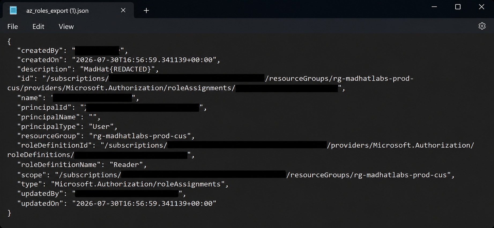
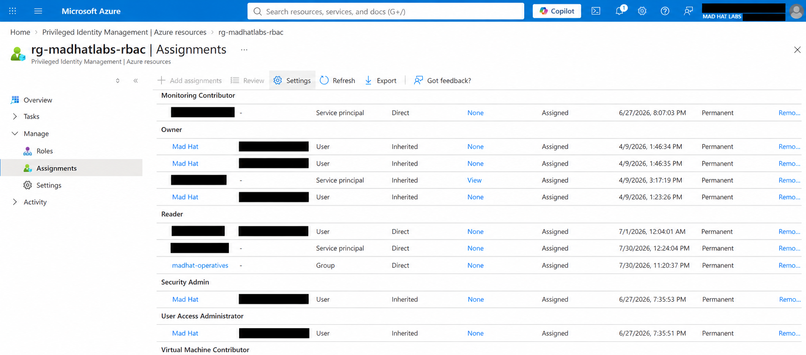

# The Privilege Audit

### Auditing Privileged Access Across Azure

## Scenario

This assessment focused on auditing privileged access across a live Azure environment.

Rather than investigating a known security incident, the goal was to determine **who had privileged access, where that access applied, and whether the assignments were necessary and properly managed**.

I performed the audit using multiple Azure methods to compare what each could reveal and where each had visibility gaps.

---

## Environment

* **Platform:** Microsoft Azure / Microsoft Entra ID
* **Environment:** Live multi-user Azure training tenant
* **Access:** Reader access, plus one PIM-eligible role
* **Services reviewed:** Azure RBAC, Microsoft Entra ID, Privileged Identity Management (PIM)
* **Tools used:**

  * Access Control (IAM)
  * Azure CLI
  * Azure Resource Graph Explorer / KQL
  * Microsoft Entra Privileged Identity Management (PIM)
* **Audit focus:** Privileged role assignments, excessive access, orphaned assignments, standing vs. eligible privilege, and assignment scope

> **Note:** Sensitive lab values have been intentionally redacted. Challenge flags, RoleAssignmentDescription values, orphaned principal IDs, and other challenge-specific identifiers are not included.

---

# Scope and Methodology

Azure provides several methods for reviewing role assignments, but each method exposes different information.

For this audit, I reviewed privileged access using four Azure tools and then performed a final manual hunt using the information gathered throughout the assessment.

My goal was not only to identify questionable access but also to understand **which audit method was best suited for each task and what each method could miss.**

## Methodology Comparison

| Method                   | What It Shows                                                                           | What It Can Miss                                                                  |
| ------------------------ | --------------------------------------------------------------------------------------- | --------------------------------------------------------------------------------- |
| **IAM blade / export**   | Active assignments at a selected scope, including inherited assignments                 | Group membership and easily overlooked orphaned principals                        |
| **Azure CLI**            | Scriptable RBAC assignment data, including fields that can expose unresolved principals | Typically requires querying individual scopes unless additional scripting is used |
| **Resource Graph (KQL)** | Role assignments across the Azure environment in a single query                         | Eligible PIM assignments                                                          |
| **PIM export**           | Eligible vs. active privileged assignments and activation history                       | Standing assignments that were never managed through PIM                          |

---

# Audit

## 1. Establishing an Access Baseline with IAM

### Method: Access Control (IAM) Blade

I started the privilege audit with Azure's **Access Control (IAM)** blade.

Every Azure scope has its own IAM view, including management groups, subscriptions, resource groups, and individual resources. This makes IAM the simplest starting point for determining which identities currently have access and what roles they hold.

Rather than manually inspecting every assignment, I reviewed the **Download role assignments** export. Exporting role assignments from the subscription level provides a broader view because the report can include inherited assignments as well as assignments associated with child resources.

Because my operative account had restricted visibility, I could not generate the complete export with identity names myself. For this portion of the audit, I reviewed a provided role-assignment CSV representing the data an auditor would normally obtain from the subscription-level export.

### What I Looked For

I reviewed the role-assignment export for:

* Highly privileged roles such as **Owner**
* Users with privileged access across multiple scopes
* Direct user assignments versus group-based access
* Assignments inherited from higher scopes
* Repeated or potentially redundant assignments
* Unusual assignments or identities requiring further investigation

### What I Found

The export established my initial baseline of active privilege within the subscription.

During the review, I identified a user account holding the **Owner** role at the subscription level. I also observed additional Owner assignments associated with the same identity at lower scopes in the environment.

A subscription-level Owner assignment stood out because permissions granted at a higher scope can apply to resources beneath it. This raised the question of whether the additional lower-scope assignments were necessary or whether the account had been granted more access than required.

At this stage, I did **not** assume that the assignments were malicious or incorrectly configured. Instead, I treated the pattern as something that warranted further investigation using the other audit methods.

### Blind Spot

The IAM blade and role-assignment export provide a useful view of **active RBAC assignments**, but they do not provide the complete privilege picture.

For example, an assignment may show that a group has access without showing which individual users receive those permissions through group membership.

Large exports can also make stale or unresolved identities difficult to recognize manually. An abnormal assignment can easily be buried among legitimate role assignments.

This meant I needed additional tooling to continue the audit.

### Conclusion

The IAM blade and role-assignment export were effective for establishing an initial access baseline and identifying accounts that deserved deeper investigation.

However, the method was better suited for answering:

> **"Who currently has access at this scope?"**

than determining whether every assignment was still valid, necessary, or properly managed.

The privilege pattern identified here gave me a starting point for the next phase of the audit, where I used **Azure CLI** to inspect role-assignment data more directly.

### Evidence

#### Role Assignment Export


*The role-assignment export provided a subscription-level view of active Azure RBAC assignments. Sensitive lab values, challenge flags, assignment descriptions, and identifiers have been redacted.*

---

## 2. Auditing Role Assignments with Azure CLI

### Method: Azure CLI

After establishing an access baseline with the IAM export, I used **Azure CLI** to inspect the RBAC assignments from the command line.

The CLI provides access to the same underlying role-assignment data, but in a structured format that can be filtered, scripted, and repeated. This makes it more useful for recurring audits than manually clicking through individual IAM blades.

For this portion of the audit, I queried the production resource group.

### Command Used

```bash
az role assignment list --resource-group rg-madhatlabs-prod-cus
```

---

### What I Looked For

I reviewed the returned role assignments and compared them against the IAM export from the previous step.

I focused on:

- Principal IDs associated with each assignment
- Role definitions
- Assignment scope
- Principal type
- Identities that could not be resolved
- Differences between the CLI output and the IAM export

---

### What I Found

Each RBAC assignment contained a `principalId`, which is the GUID Azure uses to associate the role assignment with an identity.

However, my operative account did not have enough Microsoft Entra permissions to resolve those GUIDs into identity names. Because of this, the `principalName` field was blank in the CLI output.

A blank `principalName` alone therefore did **not** prove that an account had been deleted.

To investigate further, I cross-referenced the assignments returned by the CLI with the IAM role-assignment export from the previous step.

This comparison revealed one assignment associated with a principal that no longer existed.

The identity had been deleted, but its Azure RBAC assignment remained.

This created an **orphaned role assignment**.

> **Note:** The orphaned principal ID and challenge-specific values have been intentionally redacted from this write-up.

---

### Why the Orphaned Assignment Matters

Deleting an identity does not automatically guarantee that every authorization object associated with it has been cleaned up.

In this case, Azure still contained an RBAC assignment for an identity that could no longer be properly identified or accounted for.

From an access-governance perspective, stale assignments create unnecessary authorization state and make access reviews less reliable. Administrators should be able to explain **who or what holds every permission and why that access is required**.

If an assignment points to an identity that no longer exists, it should be investigated and removed rather than left behind as unused permission data.

---

### Blind Spot

Azure CLI provided structured and repeatable access to the RBAC data, but it still had limitations.

My account could retrieve the role assignments but could not resolve their principal IDs into Microsoft Entra identity names. I therefore needed to cross-reference the CLI results with the IAM export to determine which assignment belonged to the deleted identity.

The command was also scoped to a single resource group. Repeating the same process manually across every resource group and scope would become inefficient in a larger Azure environment.

---

### Conclusion

Azure CLI gave me a more repeatable way to enumerate RBAC assignments and inspect the underlying data than manually navigating the Azure portal.

By comparing the CLI results against the IAM export, I identified an **orphaned role assignment belonging to a deleted principal**.

The key lesson from this method was that an access audit should not only ask:

> **"What permissions exist?"**

It should also ask:

> **"Does the identity associated with each permission still exist and still require that access?"**

CLI worked well for investigating a specific scope, but querying scopes individually would not scale efficiently across an entire Azure environment.

For the next phase of the audit, I used **Azure Resource Graph and KQL** to examine role assignments across multiple scopes in a single query.

---

### Evidence

#### Orphaned Role Assignment



*Azure CLI role-assignment data showing an unresolved principal. The principal ID, subscription ID, role-assignment identifiers, and challenge-specific description have been redacted.*

---

## 3. Sweeping Role Assignments with Azure Resource Graph

### Method: Azure Resource Graph / KQL

After using Azure CLI to investigate role assignments within a specific resource group, I moved to **Azure Resource Graph Explorer** to determine how the same type of audit could be performed across a larger Azure environment.

The IAM blade and my CLI command were both focused on individual scopes. Resource Graph instead provides a way to query Azure Resource Manager data across accessible subscriptions and resources using **Kusto Query Language (KQL)**.

For this portion of the audit, I used the orphaned principal ID identified during the previous step and searched the `authorizationresources` table for any remaining role assignments associated with it.

### KQL Query

```kusto
authorizationresources
| where type =~ 'microsoft.authorization/roleassignments'
| extend principalId = tostring(properties.principalId)
| extend description = properties.description
| where principalId == '<REDACTED-ORPHANED-PRINCIPAL-ID>'
| project name,
          principalId,
          principalType = properties.principalType,
          scope = properties.scope,
          description
```

> **Note:** The orphaned principal ID has been intentionally removed from the published query.

---

### What I Looked For

The purpose of the query was to search for role assignments associated with the orphaned identity discovered during the CLI investigation.

I focused on:

- Role assignments across accessible Azure scopes
- Assignments associated with the orphaned principal ID
- Assignment scope
- Principal type
- Stale authorization data
- Whether the same principal appeared at multiple scopes

Instead of manually checking individual IAM blades or repeatedly running CLI commands against different resource groups, Resource Graph provided a central query interface for performing the search.

---

### What I Found

When I filtered Resource Graph specifically for the orphaned principal ID, the query returned no results.

This did **not** mean the assignment had disappeared.

My operative account did not have sufficient permissions to retrieve the specific authorization data required by that query.

To verify that Resource Graph itself was working, I removed the principal-specific filter and queried the broader `authorizationresources` dataset that my account could access.

This demonstrated an important distinction during the audit:

> **No query results do not automatically mean no matching resources exist.**

The permissions of the account performing the audit determine what Resource Graph can return.

The orphaned assignment had already been confirmed through the previous IAM and CLI investigation. Resource Graph demonstrated how the same principal ID could be searched across a much larger Azure environment when the auditor has the necessary permissions.

---

### Why Resource Graph Matters

The main advantage of Resource Graph was **scale**.

Using the portal, I would need to inspect IAM at individual scopes. Using the CLI command from the previous step, I would need to query resource groups individually or build additional scripting around the process.

Resource Graph allowed the audit question to be expressed as a KQL query instead:

> **"Where does this principal still have role assignments?"**

With appropriate permissions, the same approach could be expanded to search across subscriptions for stale principals, repeated privileged assignments, unusual scopes, or other RBAC patterns.

The query can also be modified and reused, making it more practical for larger access reviews than manually navigating through Azure resources.

---

### Blind Spot

Resource Graph solved the scope problem, but it introduced another important limitation.

The `authorizationresources` data used during this audit represented **active Azure RBAC assignments**.

It did not provide the complete picture of identities that were **eligible** to activate privileged roles through Privileged Identity Management.

This means an account could potentially obtain privileged access through PIM without appearing as a currently active assignment in this portion of the audit.

Resource Graph therefore answered:

> **"What active role assignments exist across the environment?"**

but not:

> **"Who is eligible to obtain privileged access?"**

That required a different data source.

---

### Conclusion

Azure Resource Graph showed how an RBAC audit could move from investigating individual scopes to searching authorization data across a much larger Azure environment.

The biggest lesson from this method was that **audit coverage depends on both the query and the permissions of the auditor running it**. An empty result should be interpreted in the context of the account's visibility rather than automatically treated as proof that an assignment does not exist.

At this point, the audit methods had progressed from:

**IAM → visual access baseline**

**Azure CLI → structured investigation of a specific scope**

**Resource Graph → scalable KQL-based search across Azure**

However, all three methods were focused on **active access**.

For the next phase of the audit, I used **Privileged Identity Management (PIM)** to investigate the other side of privileged access: identities that may not currently hold a privileged role but are eligible to activate one.


---

## 4. Auditing Eligible vs. Active Privilege with PIM

### Method: Privileged Identity Management (PIM)

The first three methods focused primarily on **active Azure RBAC assignments**.

That answered an important question:

> **"Who has access right now?"**

However, it did not completely answer:

> **"Who is capable of obtaining privileged access?"**

To investigate that side of the environment, I used **Microsoft Entra Privileged Identity Management (PIM)**.

PIM distinguishes between users who have a role assigned permanently and users who are only **eligible** for a role and must activate it when needed.

---

### What I Did

In the Azure portal, I opened **Privileged Identity Management** and navigated to:

**PIM → Azure resources → Assignments**

My operative account did not have enough access to perform a complete subscription-level PIM review.

Instead, I selected a resource group within my permitted scope and reviewed its:

- Eligible assignments
- Active assignments
- Expired assignments
- Assignment type
- Assignment duration
- Role
- Scope

I also reviewed the available **Export** functionality, which allows PIM assignment information to be exported for further analysis.

With sufficient subscription-level permissions, the same process could be used to export role-assignment details for the subscription and resources beneath it.

---

### What I Looked For

I focused on the difference between **standing privilege** and **eligible privilege**.

Specifically, I looked for:

- Highly privileged roles
- Permanently assigned privileged access
- PIM-eligible assignments
- Direct versus inherited assignments
- Assignment duration
- Privilege that could potentially be moved from permanent access to temporary activation
- Previous role activations that could provide context about how privileged access was being used

---

### What I Found

PIM exposed information that the previous audit methods did not provide.

The Assignments view showed whether access was **eligible or active**, along with information about how the assignment had been granted and its duration.

During the review, I observed privileged roles configured as **permanent assignments**.

This was significant because a permanent privileged assignment represents standing access: the identity retains those permissions continuously rather than receiving them only when the privileges are required.

The presence of a permanent assignment does not automatically mean that the configuration is incorrect. Some identities or workloads may legitimately require standing access.

However, privileged user access should be reviewed to determine whether permanent assignment is actually necessary or whether the role could instead be made **PIM-eligible**.

---

### Why Standing Privilege Matters

Standing privileged access increases the amount of time powerful permissions are available to an account.

If a privileged account is compromised while the role is permanently assigned, the attacker may immediately inherit those permissions.

PIM can reduce this exposure by allowing privileged roles to remain inactive until they are required.

Depending on organizational policy, activation can also require controls such as:

- Multi-factor authentication
- Business justification
- Approval
- Time-limited activation

This changes privileged access from:

> **"This account always has this permission."**

to:

> **"This account can obtain this permission when there is a legitimate reason to use it."**

For an access audit, that distinction is important.

---

### Activation History

PIM also provides audit information showing how privileged access has been activated and used over time.

This allows an auditor to investigate questions such as:

- Who activated a privileged role?
- Which role was activated?
- When was it activated?
- How long was the access available?
- Was justification provided?
- Does the activation pattern match the user's expected responsibilities?

This provides context that a normal list of RBAC assignments cannot provide.

---

### Blind Spot

PIM solved the visibility problem around **eligible privilege**, but it was still not a complete replacement for the previous audit methods.

PIM is strongest when investigating privileged access that is actually being managed through PIM.

Standing RBAC assignments that were never brought under PIM still need to be discovered through methods such as IAM, Azure CLI, or Resource Graph.

My own visibility was also limited by the permissions of my operative account. I could audit PIM assignments for resources within my permitted scope, but I could not perform the same complete review across the entire subscription.

This reinforced a pattern I encountered throughout the audit:

> **The quality of an access review depends not only on the auditing tool, but also on the visibility granted to the auditor.**

---

### Conclusion

PIM filled the largest visibility gap left by the previous three methods.

The audit had now answered two separate questions:

**IAM, CLI, and Resource Graph:**

> **"Who currently has access?"**

**Privileged Identity Management:**

> **"Who has privileged access, and who is eligible to activate it?"**

This distinction is critical when reviewing privileged access because an account does not need to hold an active privileged role continuously to represent potential privileged access.

PIM also provided the information needed to distinguish **standing privilege from just-in-time privilege**, making it possible to identify accounts whose permanent access should be reviewed.

The final phase of the audit was to combine the information gathered from all four methods and manually investigate an over-provisioned identity.

---

### Evidence

#### PIM Role Assignments



*Privileged Identity Management was used to review role assignments, assignment state, inheritance, and duration at an Azure resource scope. Usernames, service-principal identifiers, and lab-specific identity information have been redacted.*


---

