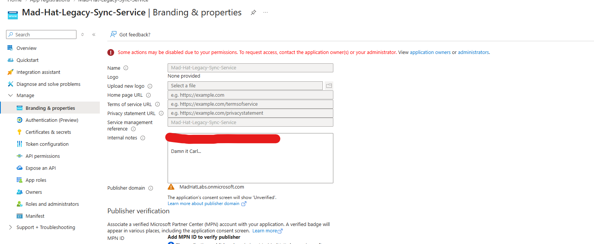
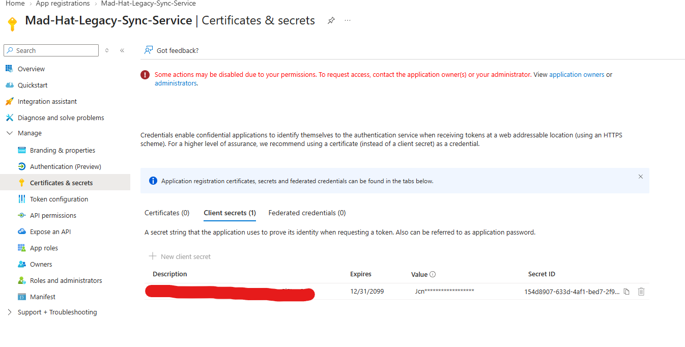

# The Stolen Identity

## Scenario
An unauthorized user gained access to the Mad Hat Labs tenant sometime within the previous 24 hours, with no security alerts indicating an obvious compromise.
The investigation focused on the identity plane to determine how the attacker gained access, which identity or application was involved, and what access they may have retained inside the tenant.

## Environment
One list: platform, services, tools, access level. Honest framing: "live multi-user Azure training tenant, Reader access."

## Investigation

### 1. Identified the Legacy Application
I reviewed the **App registrations** in Microsoft Entra ID and found an application named `Mad-Hat-Legacy-Sync-Service`.
While reviewing the application's **Branding & properties**, I found an internal note referencing **Carl from Accounting**.
This gave me my first lead and pointed me toward Carl's connection to the application.

### 2. Found a New Client Secret on the Legacy Application
Following the lead from Carl's ownership of `Mad-Hat-Legacy-Sync-Service`, I opened **Certificates & secrets** and reviewed the **Client secrets** tab.
I found a single client secret whose **Description** contained the flag. The **Expires** date was also set nearly a century into the future, indicating that the credential had been created for long-term persistence.
This showed how the attacker used Carl's Owner access to add a new credential to the application and gain access through the application's service principal rather than continuing to authenticate as Carl.

## What broke / what surprised me
The most credible section in the document. Dead ends, wrong guesses, the thing that took an hour. Employers know real work is messy. This section separates you from certificate collectors.

## Findings and recommendations
What you determined, plus 2 or 3 recommendations as if you were reporting to the resource owner.

## What I learned
3 to 5 bullets. At least one technical, one "what I'd do differently."
