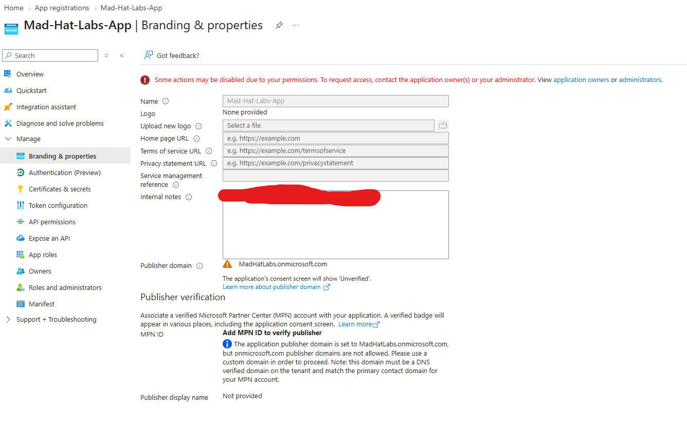
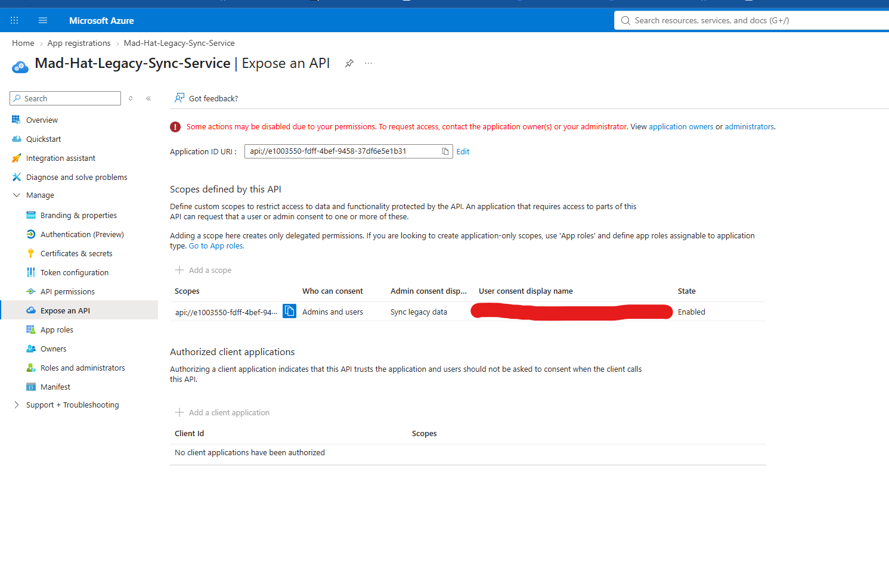
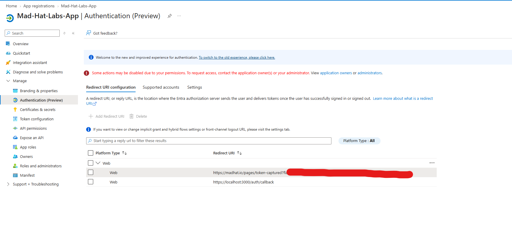

# The Stolen Identity

## Scenario
An unauthorized user gained access to the Mad Hat Labs tenant sometime within the previous 24 hours, with no security alerts indicating an obvious compromise.
The investigation focused on the identity plane to determine how the attacker gained access, which identity or application was involved, and what access they may have retained inside the tenant.

## Environment

- **Platform:** Microsoft Azure / Microsoft Entra ID
- **Environment:** Live multi-user Mad Hat Labs Azure training tenant
- **Services:** Entra ID, App registrations, Enterprise applications, Microsoft Graph
- **Tools:** Azure Portal
- **Access level:** Limited tenant access within a shared training environment

## Investigation

### 1. Identified the Legacy Application
I reviewed the **App registrations** in Microsoft Entra ID and found an application named `Mad-Hat-Legacy-Sync-Service`.
While reviewing the application's **Branding & properties**, I found an internal note referencing **Carl from Accounting**.
This gave me my first lead and pointed me toward Carl's connection to the application.

### 2. Found a New Client Secret on the Legacy Application
Following the lead from Carl's ownership of `Mad-Hat-Legacy-Sync-Service`, I opened **Certificates & secrets** and reviewed the **Client secrets** tab.
I found a single client secret whose **Description** contained the flag. The **Expires** date was also set nearly a century into the future, indicating that the credential had been created for long-term persistence.
This showed how the attacker used Carl's Owner access to add a new credential to the application and gain access through the application's service principal rather than continuing to authenticate as Carl.

### 3. Discovered a Rogue Application Added as an Owner
I reviewed the **API permissions** on `Mad-Hat-Legacy-Sync-Service` and confirmed that it had Microsoft Graph application permissions with **admin consent** already granted.
I then checked the application's **Owners** and found a service principal named `Mad-Hat-Labs-App`. This was tied to a separate app registration created by the attacker and had been added as an owner of the legacy application.
I opened `Mad-Hat-Labs-App` under **App registrations** and reviewed its **Branding & properties**, where I found an internal note containing the next flag.
This showed that the attacker had established another persistence path by giving their newly created application ownership over `Mad-Hat-Legacy-Sync-Service`.

### 4. Found a Backup Persistence Mechanism
I continued reviewing `Mad-Hat-Legacy-Sync-Service` and opened the **Expose an API** blade to check for any custom scopes configured on the application.
Under **Scopes defined by this API**, I found a custom scope created by the attacker. The **User consent display name** contained the next flag.
This revealed another persistence mechanism that could be used with the attacker's rogue application if the original client secret was discovered and rotated.

### 5. Traced the OAuth Phishing Setup
I opened the **Authentication** blade of the rogue `Mad-Hat-Labs-App` and reviewed its configured **Redirect URIs**.
I found two redirect URIs: one appeared to be a normal local-development address, while the other pointed to an attacker-controlled domain. The suspicious URI contained a URL-encoded flag within its query string.
After decoding the value, I confirmed that the rogue application was configured to receive authorization codes from users who consented to the attacker's OAuth request.
This completed the persistence chain by showing how the rogue app, exposed API scope, and malicious redirect URI could be combined to collect tokens from users.

## What broke / What surprised me
The biggest surprise was how many persistence options were available through a single compromised identity. My first assumption was that rotating Carl's password and removing the suspicious client secret would cut off the attacker's access.
As I continued investigating, I found that the attacker had built multiple layers of persistence into the application environment. The rogue app registration, ownership relationship, custom API scope, and redirect URI meant that simply resetting the original credentials would not address everything the attacker had changed.
I also did not initially realize how important app ownership was. Carl did not need a highly privileged Entra ID role for his account to be useful to the attacker; his ownership of a privileged legacy application was enough to start the escalation.
## Findings and recommendations
I determined that the attacker used Carl's access to take control of `Mad-Hat-Legacy-Sync-Service` and establish multiple persistence mechanisms. These included a long-lived client secret, the rogue `Mad-Hat-Labs-App` registration, ownership of the legacy application, a custom API scope, and a suspicious OAuth redirect URI.
I would recommend:
- **Review and remove unnecessary application owners**, especially user accounts attached to legacy or highly privileged applications.
- **Audit app registrations and credentials regularly** for long-lived client secrets, unknown service principals, custom API scopes, and suspicious redirect URIs.
- **Restrict application registration and user consent where appropriate** and review existing OAuth grants so compromised users cannot easily introduce rogue applications or persistent delegated access.
## What I learned
- An account does not need a privileged directory role to create a serious security problem if it owns an application with powerful permissions.
- Client secrets are only one part of application persistence. Owners, service principals, API scopes, redirect URIs, and OAuth grants also need to be investigated.
- OAuth abuse can allow an attacker to obtain access through legitimate Entra ID authorization flows instead of repeatedly signing in with stolen user credentials.
- I initially focused too heavily on the compromised user. In a future investigation, I would pivot earlier from the identity into every application, service principal, credential, and OAuth relationship that identity controls.
